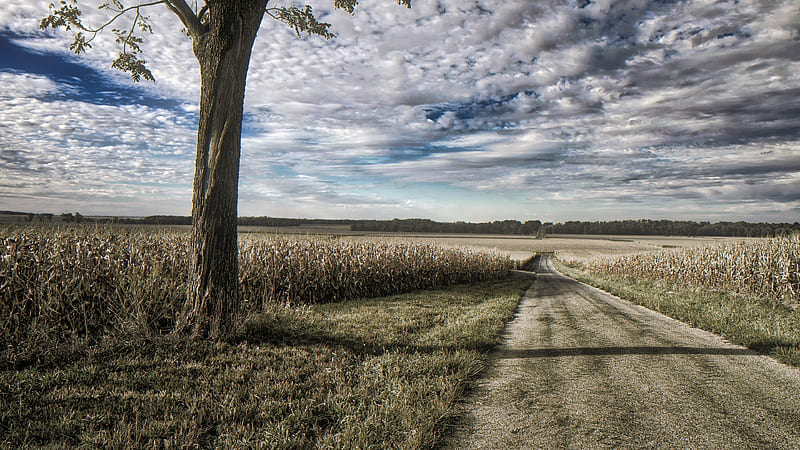

# مفهوم ابر و خاک

با گروه تاویژه و گری وی (به ترجمه و جمع آوری تیم [میم بیگدلی عزیز](https://mimbigdeli.ir/downloads/garyvee-original-films/)) همراه باشید.
.
گری میگه من زمانم رو روی چشم انداز ، استراتژی و دانش درباره کارم قرار میدم. هر چیزی که بین این موارد قرار داره برای من بی ارزش هستند. در ادامه بحث رو شروع میکنه به توضیح دادن و میگه:

> یه دنیای با ارزش زمانی اتفاق میوفته که در جواب یک لطف از یک فرد فقط در همون لحظه به دنبال لطف متقابل نباشیم، بلکه در مقابل این لطفشون، ایجاد رابطه کنیم و باهاشون برای آینده برنامه بریزیم که هر دو ما سود ببریم و پیشرفت کنیم.

## ابر

پس برای مثال من برای اینکه توی کارم موفق بشم،شروع به انجام یک سری کارها مثل سوشیال مارکتینگ میشم که به هدفم برسم. (این میشه مفهوم کلی ابر)

> لازمش اینه که فرد با دقت نگاه کنه، فرصت هارو شناسایی کنه و این فرصتها به نفع خودش استفاده کنه و اگر با همین روند تحقیقات رو انجام بده میتونه از دیدن گذشته یک ، آینده اون رو نسبی حدص بزنه. در انتها هم فرصت خوبی پیدا میکنه که این فرصت به همکارش هم توضیح بده.

## خاک

حالا خاک میشه واقعیت کارهایی که ما انجام میدیم درست مثل تولید محتوا. کلید طلایی برای درست کردن استراتژیی که محتوای ما به دید مشتراکان مربوطمون برسن اینه که برای بازه زمانی ۳۰ الی ۹۰ روزه در مکان مناسبش که هم فیسبوک و اینستاگرامه تست کنیم.

## چنتا نکته قشنگ

یک بیلبرد توی شهر الان میزان ارزشش از ۵ ساله پیش کمتر شده. چرا؟ چون مردم سر خودشون رو گرم به گوشیاشون کردن حتی توی ماشین!

کارفرما ها، مدیرعاملان حتی افراد تازه کار همواره به جای واقع گرایی و دید واقعی به اتفاق های اطرافشون، دید نسبی احساسی منطقی میگیرند.

معمولا توییت ها برای افزایش سطح تعامل فرد در استراتژی شبکه اجتماعی هست (در واقع یه نخ دادن با یک جمله).

## نتیجه:

اگه شما این موارد رو به خوبی درک کنید دیگه نیازی به دقت به حواشی بین ابر و خاک نیست. پس من همیشه در بهترین حالت ممکن خودمو وقف کار و یادگیری مهارتاش میکنم و نه حواشی. (سرگرم حواشی نباشیم و به اصل کار و مهارت های اون دقت کنیم.)
