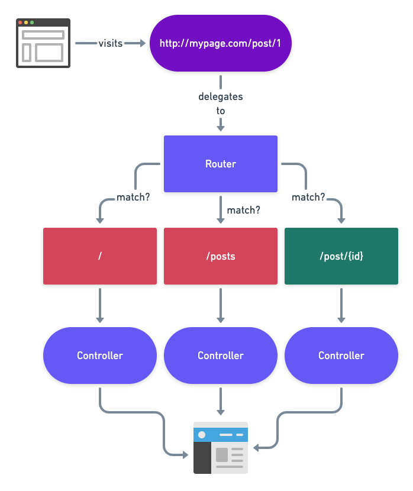

Creating New Laravel Project Using Composer

first install composer from [here](https://getcomposer.org/download/)! then install xampp! then add `c:\xampp\php` on top of path in global environments.
how to create a Laravel project?

```cmd
composer create-project laravel/laravel
```

then put in in xampp.

---

simple way to use laravel without next 2 h2s

use cmd then do `cd C:\xampp\htdocs` then do `php artisan serve` then use any browser and go to `http://127.0.0.1:8000`.

Setting Up Local Domain

go to `c:\xampp\apache\conf\httpd.conf` and got to line 521 then make sure `vhosts.conf` is not commented. then go to `c:\xampp\apache\conf\extra\httpd-vhosts.conf` then uncomment 27 to 34. remove first line about admin then change settings as below

```conf
<VirtualHost *:80>
    DocumentRoot "C:/xampp/htdocs/laravel/public"
    ServerName laravel.test
    ServerAlias www.laravel.test
    ErrorLog "logs/laravel.test-error.log"
    CustomLog "logs/laravel.test-access.log" common
</VirtualHost>
```

---

Setting Up Host on the System

go to `C:\Windows\System32\drivers\etc\hosts` then add `127.0.0.1 laravel.test`

---

# learning laravel with piotr jura

## Project Structure

these folder matter the most in any project

- app folder - business logic of our application. handling a request or sending data to database and =models= and =controllers in Http=.
- config folder - for configuring our application.
- database folder - for modifying and working with database schema.
- public folder - contains entry points to our application and contains scripts, images and styles.
- resources - alo contains scripts, images and styles plus translations and =views= folder.
- routes folder - to configure routes to our application.
- storage, tests, vendor - contains third party libraries.

these files matter the most in any project

- .env - for placing environment settings for our application.
- artisan - php script that will run our application on command line.

by running `php artisan` in our project directory we will get list of commands like below:

- queues - will run along our application and process background jobs.
- route:list - will give us list of all registered routes.
- migrates - are for managing database schema.
- make - make commands help to scaffold our projects.
- tinker - makes a new shell to interact with laravel application with command line.
- serve - will start a server for running our project.

we can make our commands and add them here too.

## Routing

### How routing works (diagram)


